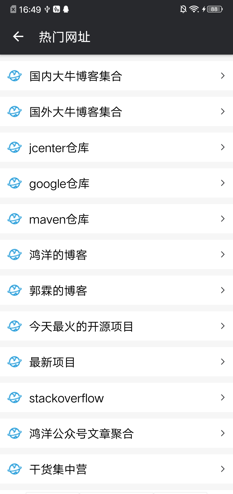
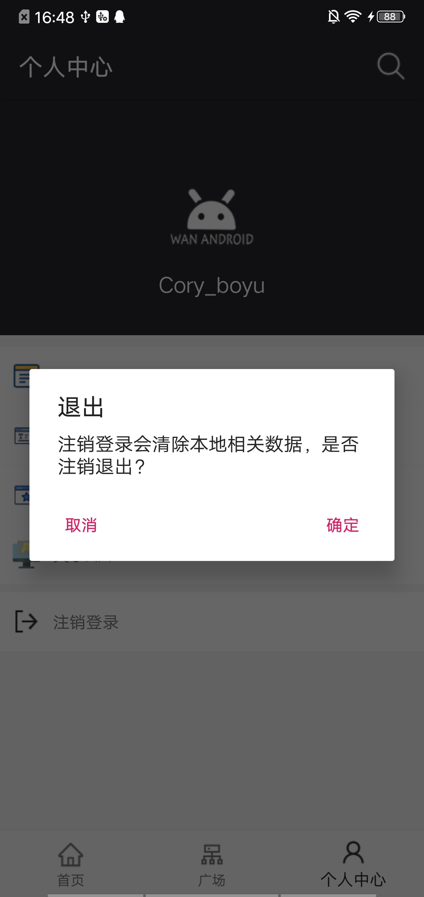

# WanAndroid
* 一款使用[`Kotlin`](https://github.com/JetBrains/kotlin)编写的[`WanAndroid`](http://wanandroid.com/)客户端
* `WanAndroid`官网：[wanandroid.com](http://wanandroid.com/)
* `Api`:[`WanAndroid`开放`API`](http://wanandroid.com/blog/show/2)

### 运行截图
 | |  
:-------------------------:|:-------------------------:|:-------------------------:
  |   |  
  |   |  
  |   |  
  |   |  
