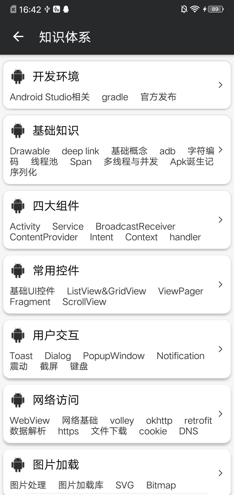
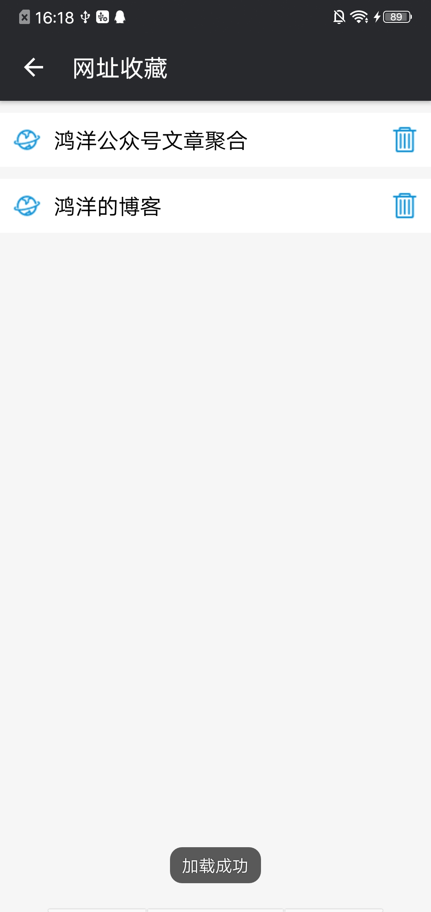
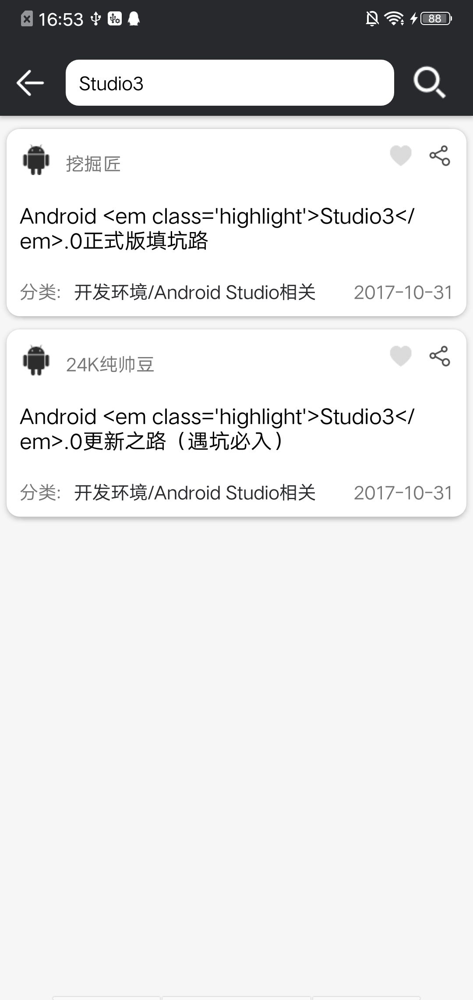
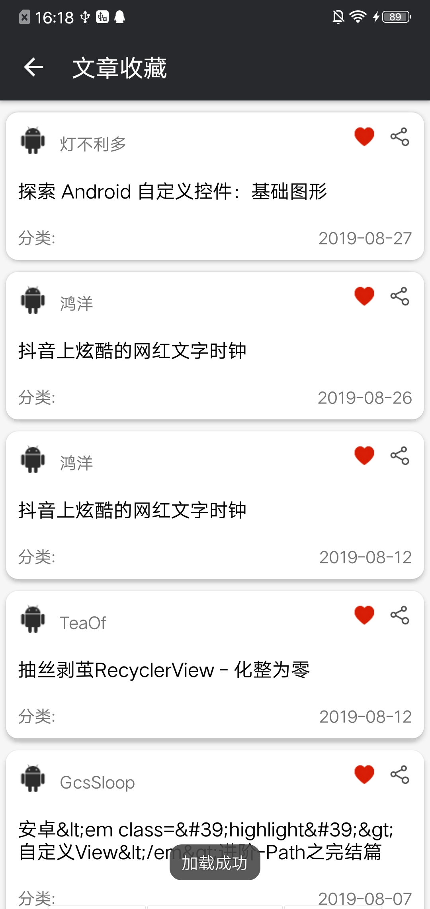

# WanAndroid
* 一款使用[`Kotlin`](https://github.com/JetBrains/kotlin)编写的[`WanAndroid`](http://wanandroid.com/)客户端
* `WanAndroid`官网：[wanandroid.com](http://wanandroid.com/)
* `Api`:[`WanAndroid`开放`API`](http://wanandroid.com/blog/show/2)

### 代码结构
**Kotlin + MVP + Retrofit2**
- [Retrofit2](https://github.com/square/retrofit)
- [鸿神的Flowlayout](https://github.com/hongyangAndroid/FlowLayout)
- [BRVAH](https://github.com/CymChad/BaseRecyclerViewAdapterHelper)
- [webview封装-Agentweb](https://github.com/Justson/AgentWeb)
- [ImmersionBar](https://github.com/gyf-dev/ImmersionBar)
- [图片加载Glide](https://github.com/bumptech/glide)

### 功能
- [x] 首页
- [x] 模块广州
- [x] 个人中心
- [x] 注册，登录和登出
- [x] 首页推荐文章和轮播展示
- [x] 文章/网页查看，收藏和分享
- [x] 知识体系列表展示
- [x] 知识专题展示
- [x] 常用网址列表展示
- [x] 个人收藏网址查看及删除

### 运行截图\
#### 首页三个模块
 |  |  
:-------------------------:|:-------------------------:|:-------------------------:
#### 文章查看及分享
  |   |  
:-------------------------:|:-------------------------:|:-------------------------:
  |   |  
:-------------------------:|:-------------------------:|:-------------------------:
#### 知识体系
 |   | 
:-------------------------:|:-------------------------:|:-------------------------:
#### 热门网址及收藏
 |    |  
:-------------------------:|:-------------------------:|:-------------------------:
#### 搜索文章及收藏
  |    |  
:-------------------------:|:-------------------------:|:-------------------------:
#### 用户操作界面
 |  | 
:-------------------------:|:-------------------------:|:-------------------------:

### 问题Tip
#### 当前版本在收藏常用网址的时候调用下面这个接口会由于GSON解析失败提示“收藏失败”，但实际上收藏成功的问题，可考虑使用id拼接的接口去执行收藏的操作
#### api接口

